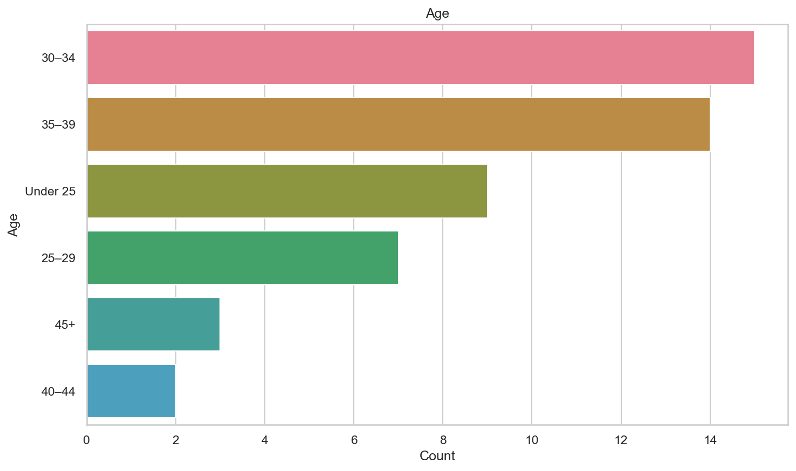
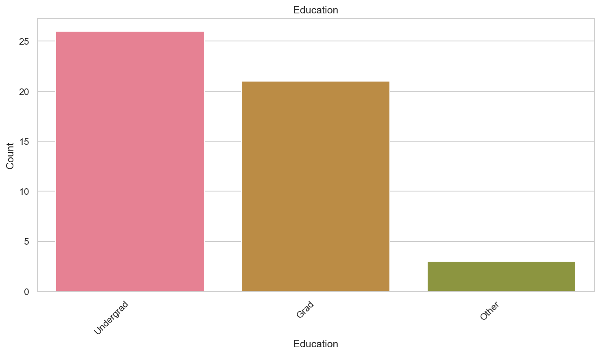
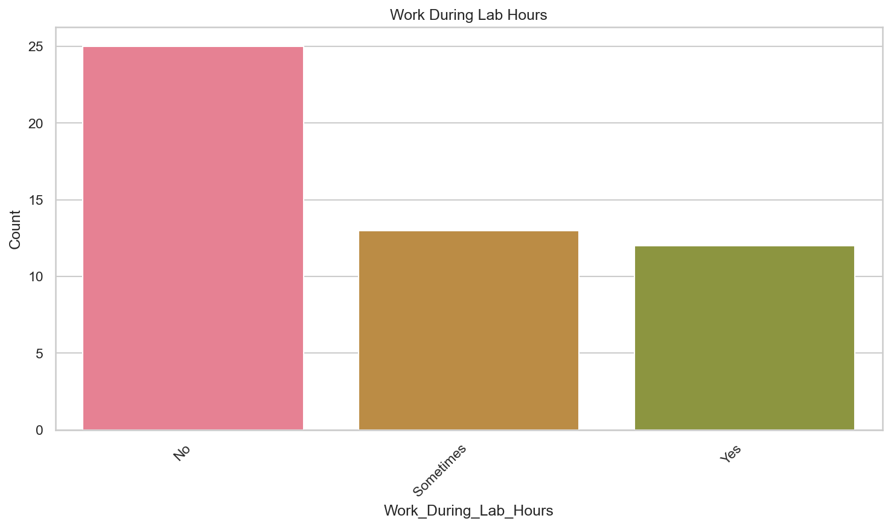
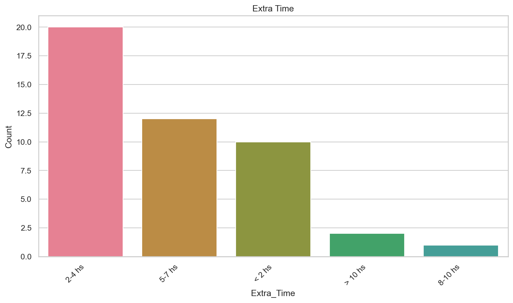
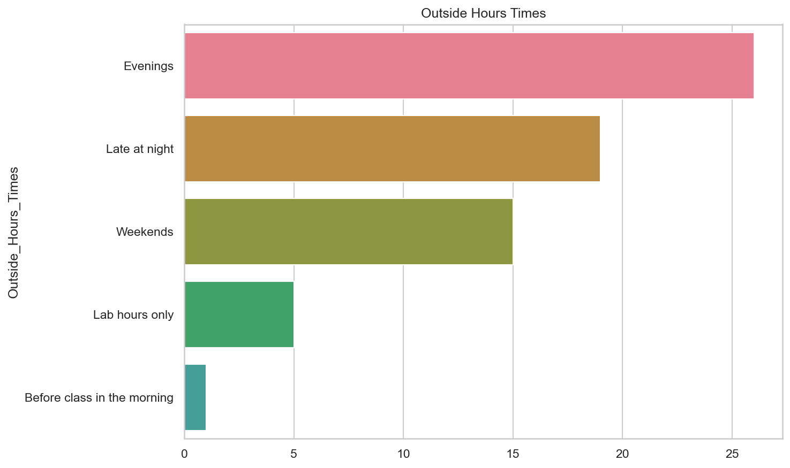
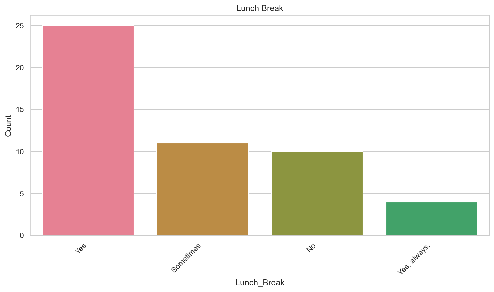
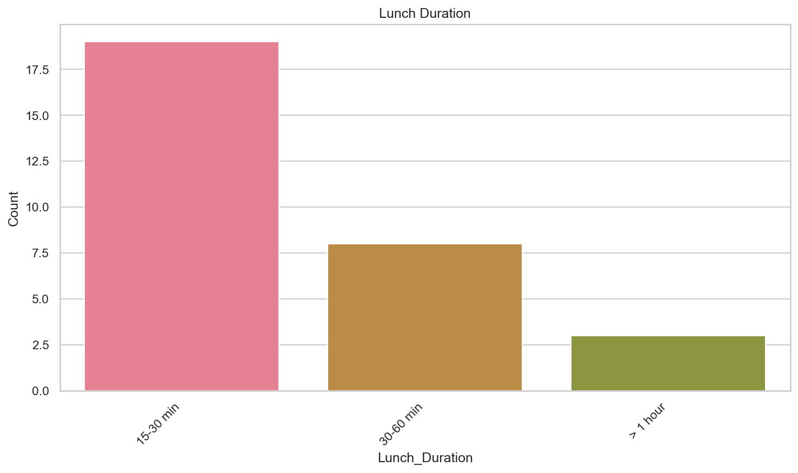
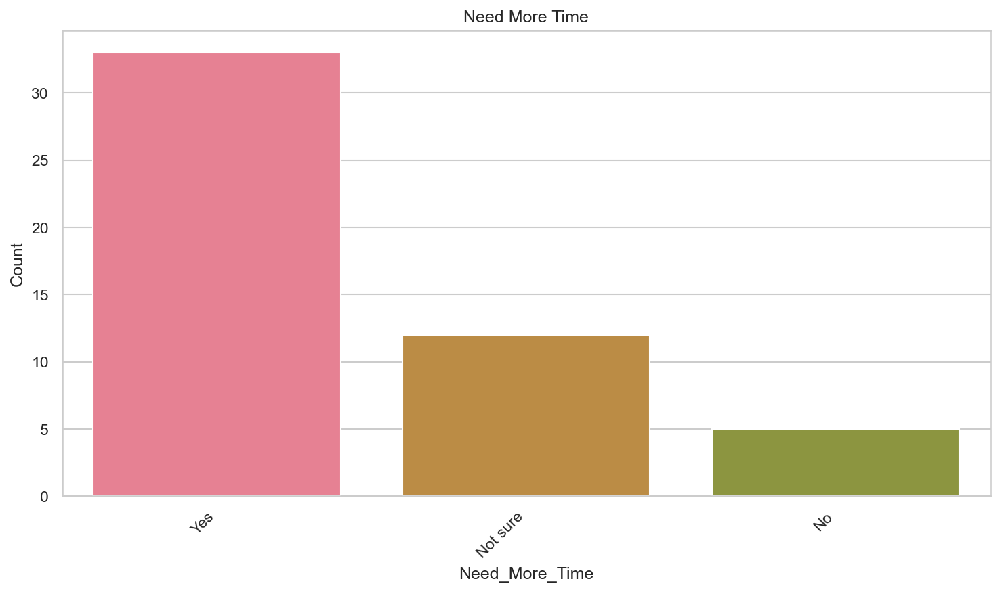
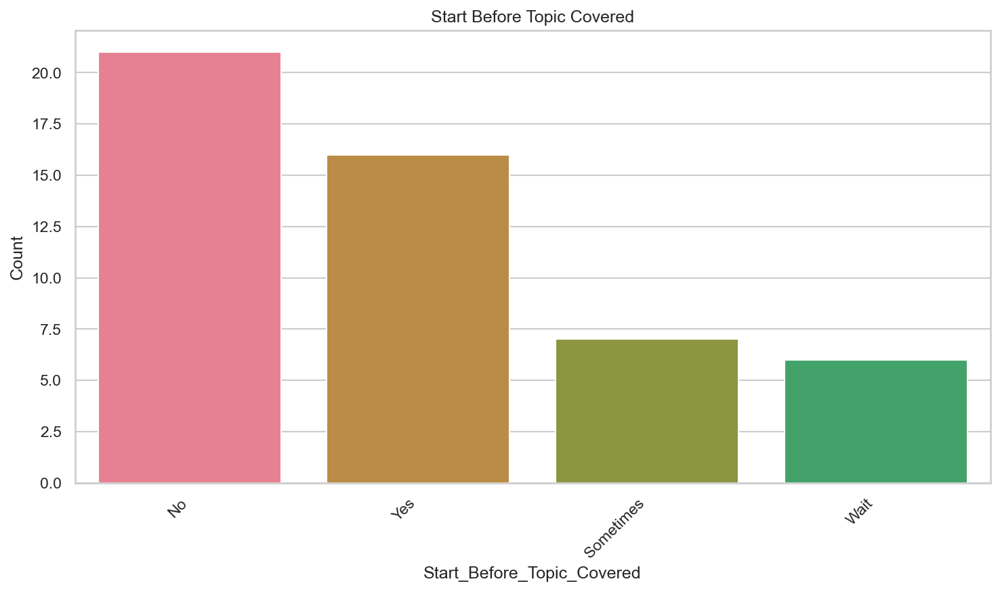
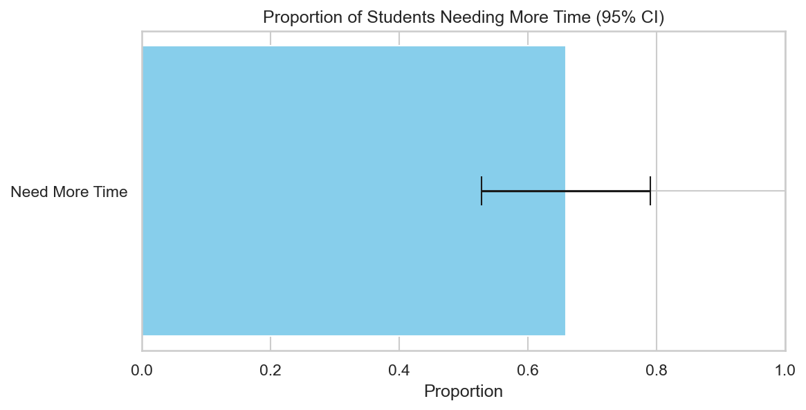

---

# Study Habits Analysis Lab Report  
**Author**: [Guillermo Fiallo Montero]  
**Course**: [Data Science - Statistics]  

---

## 🎯 Lab Objective  
This project fulfills the *"Sampling and Sampling Error: Consumer Preferences Study"* lab requirement. The goal was to:  
- Practice **sampling techniques** (convenience, synthetic augmentation)  
- Analyze **sampling errors** and their impact on data reliability  
- Demonstrate **data storytelling** with Python visualization tools  

---

## 📝 Methodology  

### 1. Survey Design & Data Collection  
- **Real Participants**: Collected 5 responses via Google Forms (time constraints limited participation)  
- **Synthetic Augmentation**: Generated 45 additional responses using:  
  ```python
  # Synthetic data generation snippet
  synthetic_data = generate_responses(n=45, demographic_profiles=real_data)
  ```  
  *Why?* To simulate a larger dataset (n=50) while maintaining proportional distributions.  

### 2. Sampling Approach  
- **Primary Method**: Convenience sampling (accessible classmates)  
- **Synthetic Strategy**: Stratified sampling based on age/education patterns from real data  

### 3. Tools & Workflow  
1. **Survey Creation**: Google Forms
2. **Data Analysis**:  
   - Python (Pandas for cleaning, Matplotlib/Seaborn for visuals)  
   - Statistical calculations (confidence intervals, margin of error)  
3. **Collaboration**: Worked with AI tutor to:  
   - Debug plotting issues (empty PNG exports)  
   - Refine sampling error explanations  

---

## 🔄 Key Challenges & Solutions  

| Challenge | Solution |  
|-----------|----------|  
| Limited real responses (n=5) | Augmented with synthetic data (n=45) |  
| Wide confidence intervals (±13%) | Documented as key learning point |  
| Plot export issues | Fixed save/show order in matplotlib |  

---

## 🔍 Key Learnings  
1. **Sampling Tradeoffs**:  
   - Convenience sampling enabled rapid data collection but introduced age/education bias  
   - Synthetic data helped practice analysis but may not reflect real-world complexity  

2. **Error Awareness**:  
   ```python
   # n=50 vs required n=361 for ±5% accuracy
   print(f"Current sample covers only {50/361:.1%} of ideal size")
   ```  

3. **Technical Skills**:  
   - Automated plot exports to PNG  
   - Dynamic report generation with Markdown  

---


# Study Habits Analysis Report

## 📋 Methodology

### Survey Questions & Response Options

#### 1. What is your age group? (Optional)
- Under 25  
- 25–29  
- 30–34  
- 35–39  
- 40–44  
- 45+  



---

#### 2. What is your current level of education? (Optional)
- Undergraduate student  
- Graduate student  
- Other (e.g., vocational training)  



---

#### 3. Do you usually start lab work before the class ends at 12:30?
- Yes  
- No  
- Sometimes  


---

#### 4. Do you only work on labs during scheduled hours (12:30–16:30)?
- Yes  
- No  
- Sometimes  



---

#### 5. How much extra time do you spend on labs weekly?
- None  
- Less than 2 hours  
- 2–4 hours  
- 5–7 hours  
- 8–10 hours  
- More than 10 hours  



---

#### 6. When do you work outside scheduled hours? (Multiple Select)
- Before class  
- Evenings  
- Late at night  
- Weekends  
- Only during lab hours  



---

#### 7. Do you take a lunch break between class and lab?
- Yes  
- No  
- Depends on the day  



---

#### 8. Lunch break duration (if yes)
- <15 minutes  
- 15–30 minutes  
- 30–60 minutes  
- >1 hour  



---

#### 9. Do you need more time than allocated?
- Yes  
- No  
- Not sure  



---

#### 10. Do you start labs before topics are covered?
- Yes  
- No  
- Sometimes  
- Wait until explained  



---

## 📊 Statistical Analysis

### Key Metric: Need for More Time
**Proportion**: 66.00%  
**95% Confidence Interval**: [52.87%, 79.13%]  
**Margin of Error**: ±13.13%  



```python
# Margin of Error Calculation
n = 50
p = 0.66
z = 1.96  # 95% confidence
se = (p * (1 - p) / n) ** 0.5  # Standard Error
margin_error = z * se
print(f"CI: [{p - margin_error:.2%}, {p + margin_error:.2%}]")
```

## 🧠 Key Insights
1. **Time Pressure**: 66% feel lab hours are insufficient (±13% margin)
2. **Reliability**: Current sample (n=50) needs expansion to 361 for ±5% accuracy
3. **Decision Risk**: True proportion could be as low as 53% or high as 79%

